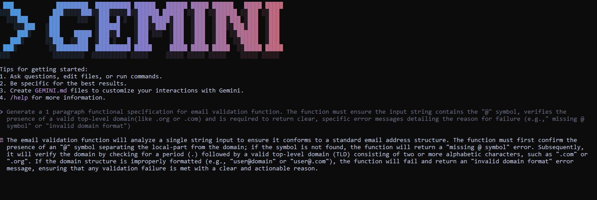

# PART A
## 1. Nine Pillars Understanding
### Why is using AI Development Agents (like Gemini CLI) for repetitive setup tasks better for your growth as a system architect?

Because it removes boring, repeated work and lets you focus on thinking, not clicking. When AI handles setup, you spend more time understanding how systems connect, how architecture works, and how decisions impact the whole project. This helps you think like a system architect instead of just a coder.

How do the Nine Pillars of AIDD help a developer grow into an M-Shaped Developer?

The Nine Pillars push you to learn multiple areas—coding, architecture, automation, AI tools, testing, problem-solving, and documentation. Because you touch all these skills, you don’t stay limited to “just coding.” Instead, you grow wide (multiple skills) and deep (strong understanding), which is what an M-Shaped Developer is.

## 2. Vibe Coding vs Specification-Driven Development
### Why does Vibe Coding usually create problems after one week?

Because Vibe Coding means you code based on “feel” without a plan. After a week, your code becomes messy, unorganized, hard to change, and full of mistakes because nothing was planned or structured.

### How would Specification-Driven Development prevent those problems?

Specification-Driven Development uses clear requirements, steps, and rules before writing code. This makes the project organized, easy to update, and easy for others to understand. You avoid chaos because the plan guides the code.

## 3. Architecture Thinking
### How does architecture-first thinking change the role of a developer in AIDD?

It shifts you from “just writing code” to “designing systems.” You start making decisions about structure, workflow, scalability, data flow, and components—just like an architect. The AI then writes the code for your design.

### Why must developers think in layers and systems instead of raw code?

Because real software is built from modules, layers, and interactions, not just lines of code. Thinking in systems helps you build apps that are clean, scalable, easy to maintain, and easy for AI agents to work on. Raw code thinking leads to confusion; system thinking leads to strong, stable projects.

# PART B

# PART C 
### 1. What is the main purpose of Spec-Driven Development?

A. Make coding faster

B. Clear requirements before coding begins ✅

C. Remove developers

D. Avoid documentation

### 2. What is the biggest mindset shift in Al-Driven Development?

A. Writing more code manually

B. Thinking in systems and clear instructions ✅

C. Memorizing more syntax

D. Working without any tools

### 3. Biggest failure of Vibe Coding?

A. Al stops responding 

B. Architecture becomes hard to extend   ✅

C. Code runs slow

D. Fewer comments written

### 4. Main advantage of using Al CLI agents (like Gemini CLI)?

A. They replace the developer completely

B. Handle repetitive tasks so dev focuses on design & problem-solving   ✅

C. Make coding faster but less reliable

D. Make coding optional

### 5. What defines an M-Shaped Developer?

A. Knows little about everything

B. Deep in only one field

C. Deep skills in multiple related domains   ✅

D. Works without Al tools

